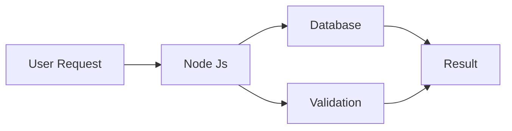

# Welcome To CoZen Search

## Introduction

CoZen Search is a small lite weight search engine. Designed not to track user data and activity. Node JS works as it's backend
> **Note:** This search engine does not support seo search

## Dependencies Installation
Node JS Modules : 1.  express, 2. node-fetch, 3. jsdom
express

    npm install express
    npm install node-fetch
    npm install jsdom

## Working Tech

> This is very simple working algorithm because I am too much lazy

## Web Server
|IP|Port |
|-------|---------|
|0.0.0.0|3000|
http://0.0.0.0:3000

